# UPF CPU 부하 예측 시스템

> 머신러닝을 활용한 5G 코어 네트워크 UPF (User Plane Function) CPU 부하 예측 시스템

---

## 프로젝트 개요

5G 코어 네트워크 UPF의 CPU 부하를 1분 단위로 예측하는 시계열 예측 시스템:
- **용량 최적화**: 과도한 프로비저닝 방지
- **장애 예방**: 피크 부하 사전 감지
- **자동 스케일링**: 예측 기반 리소스 자동 할당

**성과**: MAPE 0.60% (XGBoost 기본 Feature) / 0.34% (XGBoost 고도화 Feature)

---

## 데이터

### 원본 데이터 (1분 단위 수집)

| 컬럼 | 타입 | 범위 | 설명 |
|------|------|------|------|
| `timestamp` | datetime | - | 수집 시각 |
| `average_cpu_load` | float | 0-100% | 1분 평균 CPU 부하 (**예측 대상**) |
| `peak_cpu_load` | float | 0-100% | 1분 최대 CPU 부하 (평균 대비 1-3% 높음) |
| `active_session_count` | int | 1,000-250,000 | 활성 세션 수 (CPU 부하에 비례) |
| `pattern_id` | str/int | - | 패턴 식별자 |

### 데이터 생성 규칙

- 1분 단위 시계열
- `peak_cpu_load`는 `average_cpu_load`보다 1~3% 높음
- `active_session_count`는 CPU 사용률에 선형 비례 (CPU 20% → 1,000 / CPU 80% → 250,000)
- 평균 CPU에 정규분포 노이즈(σ=0.5) 추가
- 세션 수에 약 5% 수준의 노이즈 추가
- PCHIP 보간법으로 부드러운 일간 곡선 생성

### Train / Test 분할

| 구분 | 기간 | 샘플 수 | 일수 | 패턴 |
|------|------|---------|------|------|
| **Train** | 2024-01-01 ~ 2024-01-30 | 432,000 | 300일 | 10 패턴 × 30일 |
| **Test** | 2024-01-01 ~ 2024-01-05 | 36,000 | 25일 | 5 패턴 × 5일 |

- **분할 방식**: 시간순 분할 (무작위 셔플 없음)
- **테스트 구성**: Known 3개 패턴 + Unknown 2개 패턴

### Train 패턴 (10 패턴 × 30일)

| 패턴 | 최저 | 1차 피크 | 데일리 피크 | 설명 |
|------|------|----------|------------|------|
| 0 | 04:00 | 09:00 | 19:00 | 기본형 |
| 1 | 03:00 | 08:00 | 19:00 | 이른 시작 |
| 2 | 04:00 | 11:00 | 20:00 | 늦은 저녁 |
| 3 | 02:00 | 09:00 | 19:00 | 야간 최저 |
| 4 | 05:00 | 12:00 | 19:00 | 점심 피크 |
| 5 | 03:00 | 10:00 | 18:00 | 이른 저녁 |
| 6 | 05:00 | 09:00 | 21:00 | 늦은 저녁 |
| 7 | 04:00 | 08:00 | 17:00 | 업무시간 집중형 |
| 8 | 06:00 | 13:00 | 20:00 | 늦은 시작 |
| 9 | 03:00 | 11:00 | 18:00 | 오후 집중형 |

### Test 패턴 (5 패턴 × 5일)

| 패턴 ID | 구분 | 최저 | 1차 피크 | 데일리 피크 | 설명 |
|---------|------|------|----------|------------|------|
| known_0 | Known | 04:00 | 09:00 | 19:00 | Train 패턴 0과 동일 |
| known_3 | Known | 02:00 | 09:00 | 19:00 | Train 패턴 3과 동일 |
| known_7 | Known | 04:00 | 08:00 | 17:00 | Train 패턴 7과 동일 |
| unknown_0 | Unknown | 01:00 | 07:00 | 15:00 | 야간 업무 시스템형 |
| unknown_1 | Unknown | 08:00 | 14:00 | 23:00 | 심야 배치 작업형 |

> **Known**: 학습 데이터에 포함된 패턴 → 모델이 정확하게 예측해야 함  
> **Unknown**: 학습 데이터에 없는 새로운 패턴 → OOD(Out-of-Distribution) 대응 능력 평가

### 예측 과제

**현재 시점(t-1)까지의 데이터를 사용하여 다음 1분(t)의 `average_cpu_load`를 예측**

---

## Feature Engineering

### 기본 Feature (12개)

| 카테고리 | Feature | 설명 |
|----------|---------|------|
| **시간** | hour, dayofweek, month, day | 시간 기반 특성 |
| **이동평균** | avg_load_ma5, avg_load_ma30, avg_load_ma60 | 이동 평균 |
| **변동성** | avg_load_std5 | 이동 표준편차 |
| **순환 인코딩** | hour_sin, hour_cos, day_sin, day_cos | 순환 시간 인코딩 |

### 고도화 Feature (43개) — 기본 대비 +43% 성능 향상

| 카테고리 | Feature | 설명 |
|----------|---------|------|
| **Lag Features** | avg_load_lag1/5/10/30/60 | 과거 CPU 부하값 |
| **Lag Features** | peak_load_lag1/5/10/30/60 | 과거 피크 부하값 |
| **Lag Features** | session_lag1/5/10/30/60 | 과거 세션 수 |
| **변화율** | avg_load_change_1/5/10 | 절대 변화량 |
| **변화율 비율** | avg_load_pct_change_1/5 | 퍼센트 변화율 |
| **최대/최소** | avg_load_max5/30, avg_load_min5/30 | 윈도우 최대/최소 |
| **범위** | avg_load_range5/30 | 윈도우 범위 |
| **상호작용** | load_session_ratio, peak_avg_ratio | 교차 특성 비율 |

### Feature Engineering 비교 결과

| 지표 | 기본 Feature | 고도화 Feature | 개선도 |
|------|-------------|---------------|--------|
| MAE | 0.2833 | 0.1593 | **+43.76%** |
| RMSE | 0.3831 | 0.2514 | **+34.39%** |
| MAPE | 0.60% | 0.34% | **+43.07%** |

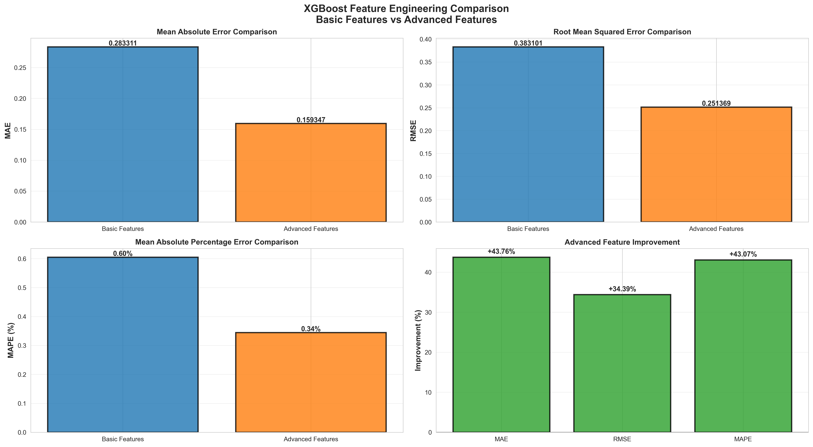

*기본 Feature vs 고도화 Feature의 MAE, RMSE, MAPE, 개선도 막대 차트 비교*

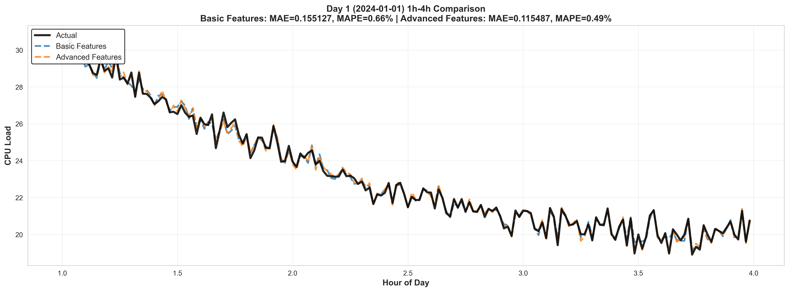

*Day 1의 1시~4시 구간 확대: 기본 Feature(파란색) vs 고도화 Feature(주황색) vs 실제값(검정)*

---

## 모델 성능

### 모델 비교

| 순위 | 모델 | MAE | MAPE | Baseline 대비 |
|------|------|-----|------|--------------|
| 1 | **XGBoost** | **0.2833** | **0.60%** | **+50.9%** |
| 2 | Baseline (Naive) | 0.5769 | 1.33% | 기준선 |
| 3 | Ensemble (XGB+LSTM) | 3.9131 | 7.28% | — |
| 4 | LSTM | 7.7881 | 14.48% | — |

### 4개 모델 비교 — Day 1

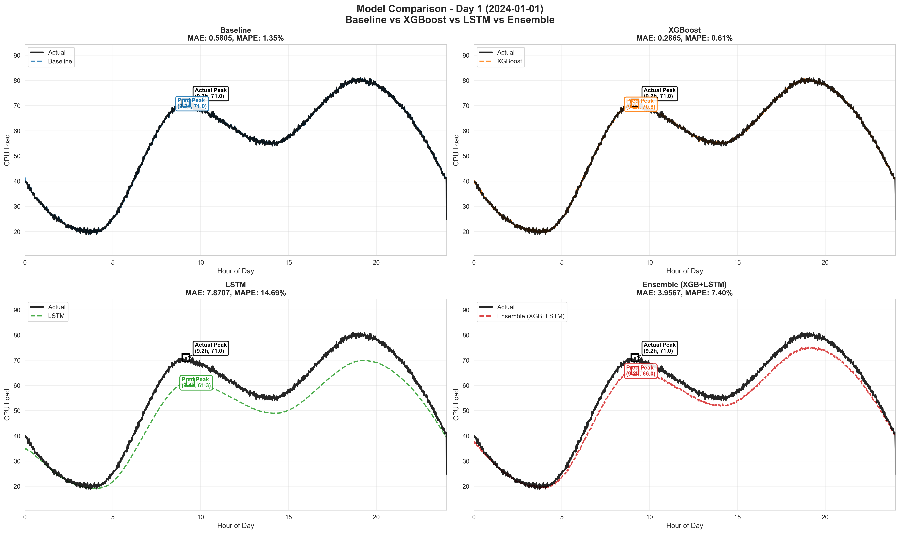

*Day 1의 4개 모델 예측 결과. 실제값 vs 예측값 라인과 최저점(○), 피크(□), 데일리 피크(△) 주요 지점 표시*

### 모델 성능 요약 차트

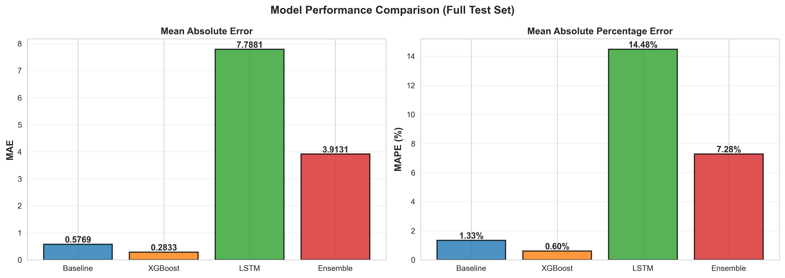

*전체 테스트셋에 대한 4개 모델의 MAE, MAPE 막대 차트 비교*

---

## XGBoost 예측 결과

### 4일치 개요 (주요 지점 표시)

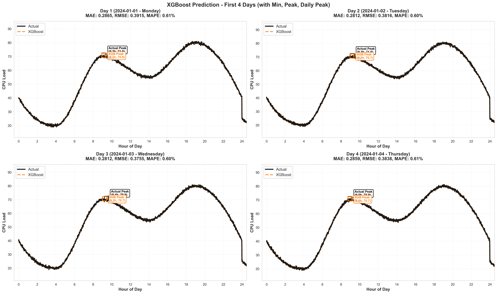

*테스트셋 첫 4일에 대한 XGBoost 예측. 실제값(검정) vs XGBoost(주황)에 최저점(○), 피크(□), 데일리 피크(△) 표시*

### 패턴별 5일 분석

#### Known 패턴 0

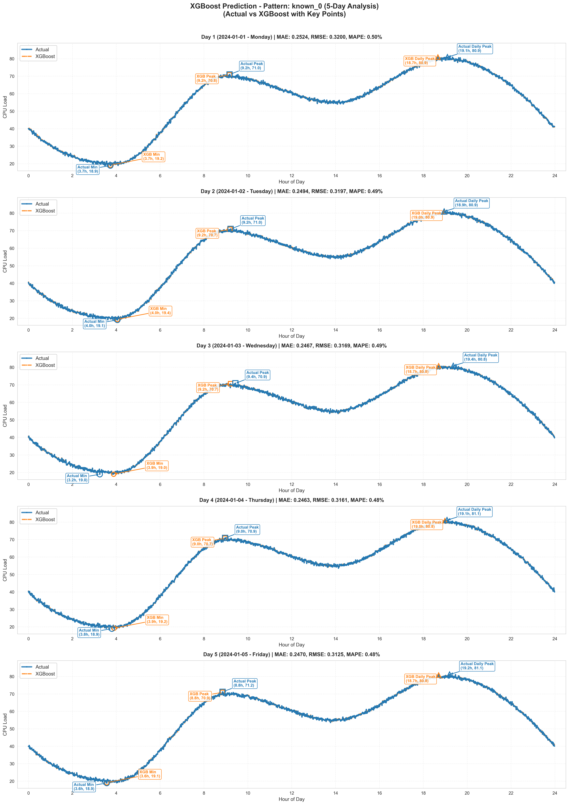

#### Known 패턴 3

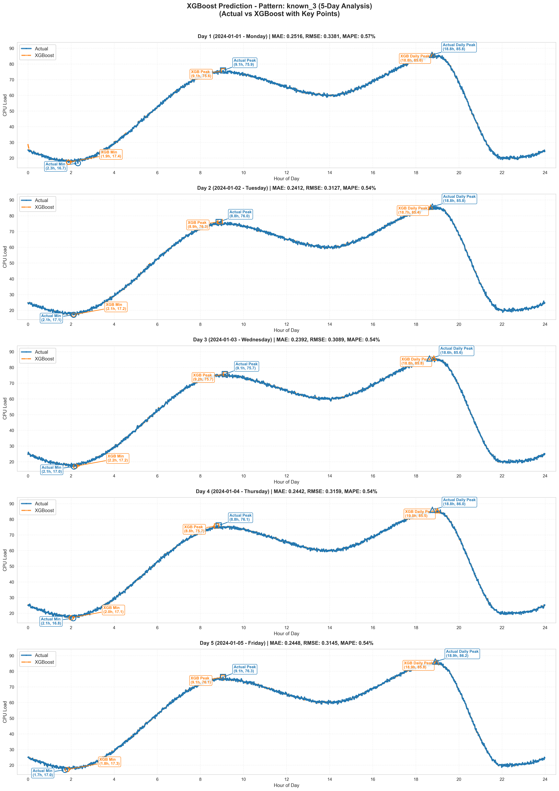

#### Known 패턴 7

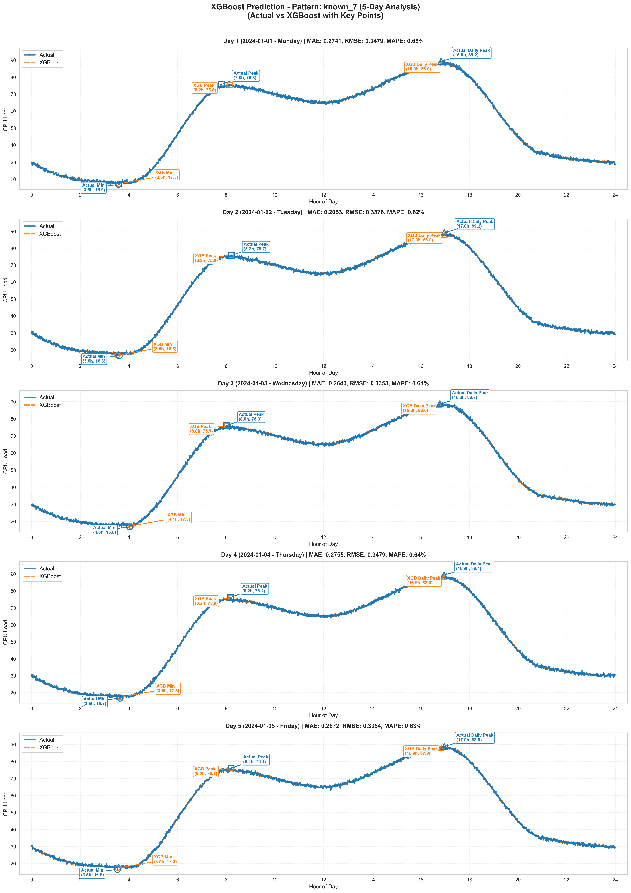

#### Unknown 패턴 0

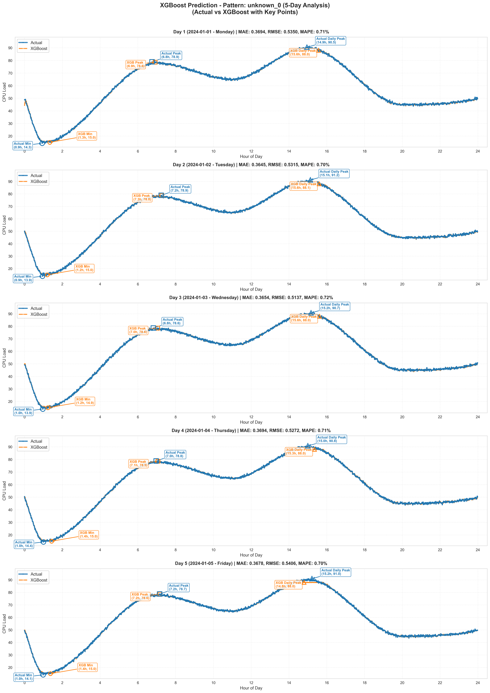

#### Unknown 패턴 1

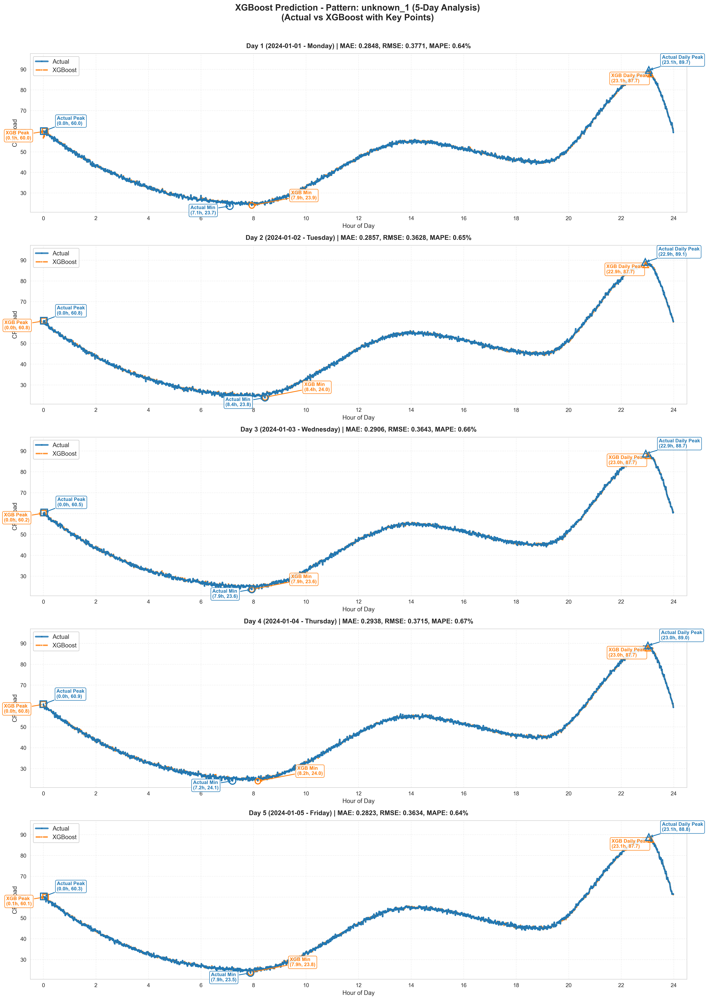

---

## 경량 모델 최적화 (네트워크 장비 배포용)

5G UPF 네트워크 장비에 직접 배포하기 위해 XGBoost pkl → ONNX 변환 및 float16 양자화를 수행합니다.

### 실행 방법

**의존성 설치**
```bash
pip install onnxmltools skl2onnx onnxruntime onnxconverter-common onnx
```

**최적화 스크립트 실행**
```bash
python optimize_xgb_onnx.py
```

### 최적화 파이프라인

```
XGBoost pkl
    │
    ▼  onnxmltools.convert_xgboost()
ONNX fp32  ──→  정확도 동일 여부 검증
    │
    ▼  float16.convert_float_to_float16()
ONNX fp16  ──→  크기 / 속도 / 정확도 벤치마크
```

### 최적화 결과 요약

| 모델 | 크기 | MAE | MAPE | 추론 레이턴시 (단일) | 비고 |
|------|------|-----|------|---------------------|------|
| XGBoost pkl | 477.1 KB | 0.2833 | 0.60% | 0.1688 ms | 원본 |
| XGBoost ONNX fp32 | 373.6 KB | 0.2833 | 0.60% | 0.0085 ms | **권장** ✅ |
| XGBoost ONNX fp16 | 373.9 KB | 0.4588 | 0.99% | 0.0090 ms | 정확도 손실 |

- **크기 감소** (pkl → ONNX fp32): 21.6%
- **속도 향상** (pkl → ONNX fp32): **19.9배**
- **정확도 유지**: MAPE 동일 (0.60%)
- fp16은 MAPE 0.39%p 손실 발생 → fp32 권장

### 벤치마크 결과 그래프

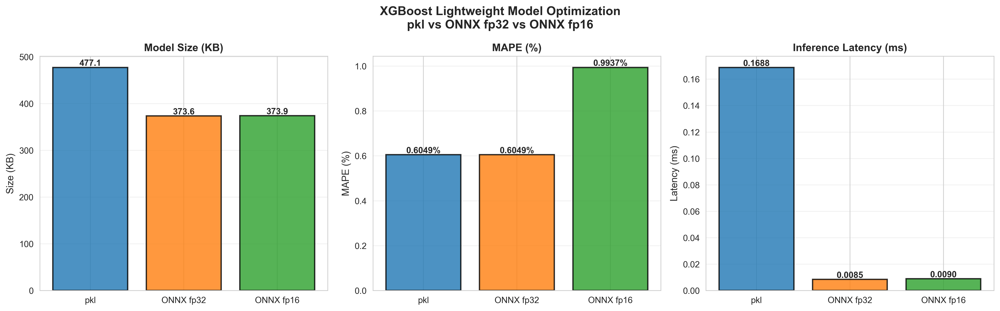

*pkl / ONNX fp32 / ONNX fp16 의 모델 크기, MAPE, 추론 레이턴시 비교*

### 배포용 추론 코드

```python
import onnxruntime as ort
import numpy as np

# 모델 로드 (ONNX fp32 권장 — 정확도 동일, 속도 19.9배)
session    = ort.InferenceSession('models/xgboost_model_fp32.onnx')
input_name = session.get_inputs()[0].name

# 실시간 예측 (단일 샘플)
features = np.array([[hour, dayofweek, peakLoad, sessionCnt,
                      avg_load_ma5, avg_load_ma30, avg_load_ma60, avg_load_std5,
                      hour_sin, hour_cos, day_sin, day_cos]], dtype=np.float32)

prediction = session.run(None, {input_name: features})[0][0]
print(f"예측 CPU 부하: {prediction:.2f}%")
```

**요구사항**: CPU 1코어, RAM 512MB, 레이턴시 <1ms

---

## 프로덕션 배포

### 모델 S3 저장

학습 완료된 XGBoost 모델을 S3에 저장하여 버전 관리 및 SageMaker 연동에 활용합니다.

**의존성 설치**
```bash
pip install boto3
```

**모델 S3 업로드**
```python
import boto3
import pickle
import io

# 학습된 모델 로드
with open('models/xgboost_model.pkl', 'rb') as f:
    model = pickle.load(f)

# 바이트로 직렬화
buffer = io.BytesIO()
pickle.dump(model, buffer)
buffer.seek(0)

# S3 업로드
s3 = boto3.client('s3', region_name='ap-northeast-2')
BUCKET = 'your-bucket-name'
KEY    = 'models/xgboost/xgboost_model.pkl'

s3.upload_fileobj(buffer, BUCKET, KEY)
print(f"✅ 모델 업로드 완료: s3://{BUCKET}/{KEY}")
```

**S3에서 모델 로드**
```python
import boto3, pickle, io

s3 = boto3.client('s3', region_name='ap-northeast-2')
BUCKET = 'your-bucket-name'
KEY    = 'models/xgboost/xgboost_model.pkl'

obj   = s3.get_object(Bucket=BUCKET, Key=KEY)
model = pickle.load(io.BytesIO(obj['Body'].read()))
print("✅ S3에서 모델 로드 완료")
```

**AWS CLI 사용**
```bash
# 업로드
aws s3 cp models/xgboost_model.pkl s3://your-bucket-name/models/xgboost/xgboost_model.pkl

# 다운로드
aws s3 cp s3://your-bucket-name/models/xgboost/xgboost_model.pkl models/xgboost_model.pkl
```

**권장 S3 폴더 구조**
```
s3://your-bucket-name/
└── models/
    └── xgboost/
        ├── xgboost_model.pkl        # 최신 버전
        ├── v1/xgboost_model.pkl     # 버전 관리
        └── v2/xgboost_model.pkl
```

### SageMaker 추론 엔드포인트

```python
import boto3, json

runtime = boto3.client('sagemaker-runtime', region_name='ap-northeast-2')

payload = {
    "features": [hour, dayofweek, peakLoad, sessionCnt,
                 avg_load_ma5, avg_load_ma30, avg_load_ma60, avg_load_std5,
                 hour_sin, hour_cos, day_sin, day_cos]
}

response = runtime.invoke_endpoint(
    EndpointName='upf-cpu-load-xgboost',
    ContentType='application/json',
    Body=json.dumps(payload)
)
prediction = json.loads(response['Body'].read())['prediction']
print(f"예측 CPU 부하: {prediction:.2f}%")
```

> 전체 SageMaker 배포 가이드: [SAGEMAKER_DEPLOYMENT.md](SAGEMAKER_DEPLOYMENT.md)

---

## 빠른 시작

### 1. 의존성 설치
```bash
pip install pandas numpy matplotlib seaborn scikit-learn xgboost boto3
```

### 2. 전체 모델 학습 및 그래프 생성
```bash
python run_all_analysis.py
```

### 3. Feature Engineering 비교
```bash
python xgboost_feature_engineering_comparison_en.py
```

### 4. 경량 모델 최적화 (ONNX 변환 + fp16 양자화)
```bash
pip install onnxmltools skl2onnx onnxruntime onnxconverter-common onnx
python optimize_xgb_onnx.py
```

### 5. 개별 분석 스크립트

| 스크립트 | 출력 파일 | 설명 |
|---------|----------|------|
| `run_all_analysis.py` | `images/model_comparison_day1.png`, `images/model_performance_comparison.png`, `images/xgboost_4days_analysis.png`, `images/xgboost_pattern_*.png` | 전체 파이프라인: 4개 모델 학습 + 전체 그래프 |
| `xgboost_feature_engineering_comparison_en.py` | `images/feature_engineering_comparison.png`, `images/day1_feature_comparison.png` | 기본 vs 고도화 Feature 비교 |
| `compare_4_models_v2.py` | `images/model_comparison_day1.png`, `images/model_performance_comparison.png` | 4개 모델 비교 |
| `xgboost_4days_analysis.py` | `images/xgboost_4days_analysis.png` | XGBoost 4일치 주요 지점 분석 |
| `zoom_model_comparison.py` | `images/zoom_1to4_hours_comparison.png` | 1시~4시 구간 확대 비교 |
| `optimize_xgb_onnx.py` | `images/onnx_optimization_benchmark.png`, `models/xgboost_model_fp32.onnx`, `models/xgboost_model_fp16.onnx` | ONNX 변환 + fp16 양자화 + 벤치마크 |

---

## 관련 문서

| 문서 | 설명 |
|------|------|
| [README.md](README.md) | 프로젝트 전체 개요 |
| [feature_description.md](feature_description.md) | Feature Engineering 상세 설명 (원본 컬럼, 기본/고도화 Feature) |
| [onnx.md](onnx.md) | ONNX 경량화 실험 결과 및 5G UPF 배포 전략 |
| [SAGEMAKER_DEPLOYMENT.md](SAGEMAKER_DEPLOYMENT.md) | AWS SageMaker 배포 가이드 |
| [upf_datagen/README.md](upf_datagen/README.md) | 데이터셋 생성 규칙 및 패턴별 시각화 |

---

## 데이터셋 (upf_datagen/)

학습/테스트 데이터셋 및 데이터 생성 코드가 포함된 폴더입니다.

```
upf_datagen/
├── ai_training_dataset.csv          # 학습 데이터 (432,000 rows, 10 패턴 × 30일)
├── ai_test_dataset.csv              # 테스트 데이터 (36,000 rows, 5 패턴 × 5일)
├── datagen.py                       # 데이터 생성 스크립트
├── ai_training_data_Pattern_0~9.png # Train 패턴별 시각화
├── ai_training_data_Test_*.png      # Test 패턴별 시각화
└── README.md                        # 데이터셋 상세 설명
```

**데이터 재현**
```bash
pip install pandas numpy matplotlib scipy
python upf_datagen/datagen.py
```

> 패턴별 상세 설명 및 시각화: [upf_datagen/README.md](upf_datagen/README.md)

---

## 프로젝트 구조

```
upf-cpu-load-prediction/
├── ai_training_dataset.csv         # 학습 데이터 (432,000 rows, 10 패턴 × 30일)
├── ai_test_dataset.csv             # 테스트 데이터 (36,000 rows, 5 패턴 × 5일)
│
├── models/                         # 저장된 모델 파일
│
├── run_all_analysis.py                          # 전체 파이프라인 (학습 + 전체 그래프)
├── xgboost_feature_engineering_comparison_en.py # Feature engineering 비교
├── compare_4_models_v2.py                       # 4개 모델 비교
├── xgboost_4days_analysis.py                    # XGBoost 4일치 분석
├── zoom_model_comparison.py                     # 1시~4시 구간 확대 비교
├── optimize_xgb_onnx.py                         # ONNX 변환 + fp16 양자화 + 벤치마크
│
├── feature_description.md                       # Feature Engineering 상세 설명
├── onnx.md                                      # ONNX 경량화 실험 결과 및 배포 전략
├── SAGEMAKER_DEPLOYMENT.md                      # SageMaker 배포 가이드
└── README.md                                    # 이 파일
```

---

## 기술 스택

| 구성 요소 | 기술 | 버전 |
|-----------|------|------|
| 언어 | Python | 3.9+ |
| 데이터 처리 | pandas, numpy | 2.0+, 1.24+ |
| ML | scikit-learn, XGBoost | 1.3+, 2.0+ |
| 딥러닝 | LSTM (numpy/sklearn 기반) | — |
| 클라우드 | boto3 (AWS S3 / SageMaker) | 1.26+ |
| 시각화 | matplotlib, seaborn | 3.7+, 0.12+ |


