# AI Training Time-Series Dataset

1분 단위 시계열 데이터로, CPU 부하 패턴 분류 모델 학습 및 테스트용으로 생성된 합성 데이터셋입니다.

## 컬럼 설명

| 컬럼 | 타입 | 설명 |
|------|------|------|
| `timestamp` | datetime | 1분 단위 타임스탬프 (2024-01-01 시작) |
| `average_cpu_load` | float | 평균 CPU 사용률 (%) |
| `peak_cpu_load` | float | 피크 CPU 사용률 (average + 1~3%) |
| `active_session_count` | int | 활성 세션 수 (1,000 ~ 250,000) |

## 데이터 생성 규칙

- 1분 단위 시계열
- `peak_cpu_load`는 `average_cpu_load`보다 1~3% 높음
- `active_session_count`는 CPU 사용률에 선형 비례 (CPU 20% → 1,000 / CPU 80% → 250,000)
- 평균 CPU에 정규분포 노이즈(σ=0.5) 추가
- 세션 수에 약 5% 수준의 노이즈 추가
- PCHIP 보간법으로 부드러운 일간 곡선 생성

---

## Train Dataset (10 patterns × 30일 = 총 432,000 rows → `ai_training_dataset.csv`)

### Pattern 0 — 최저 4시 / 1차 피크 9시 / 최고 19시 (기본형)
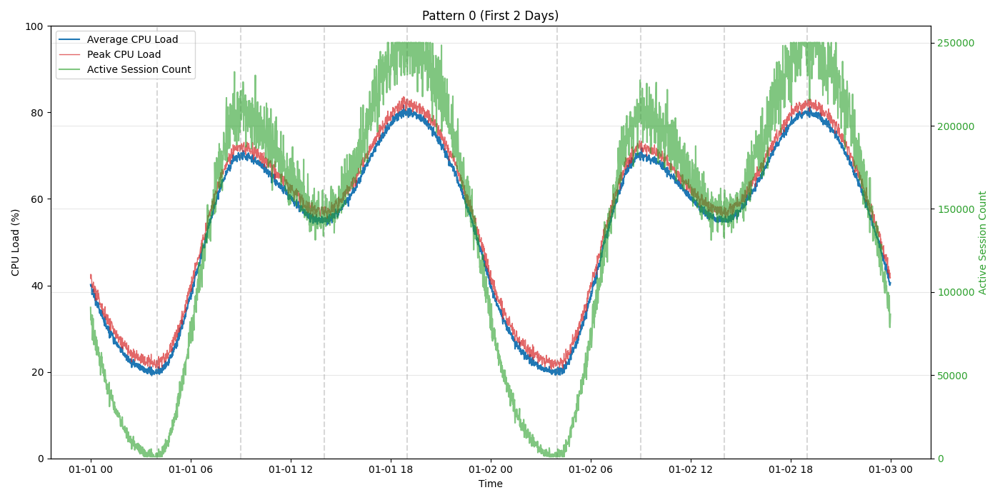

### Pattern 1 — 최저 3시 / 1차 피크 8시 / 최고 19시 (이른 시작)
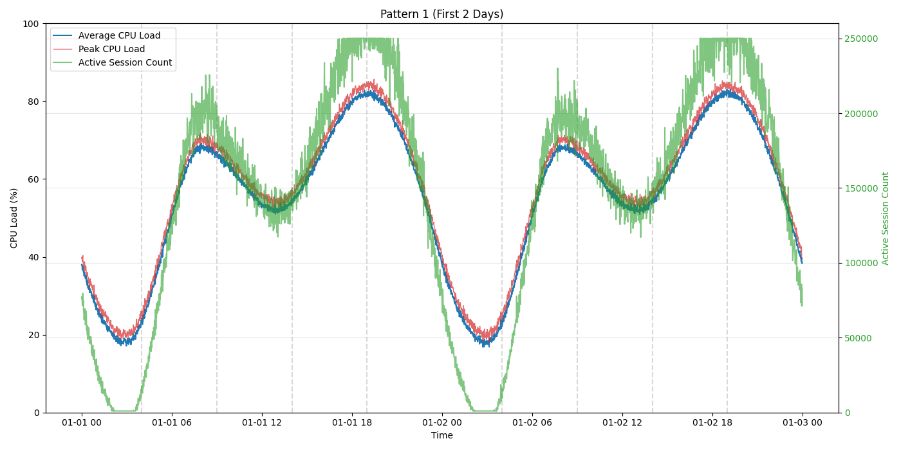

### Pattern 2 — 최저 4시 / 1차 피크 11시 / 최고 20시 (늦은 저녁)
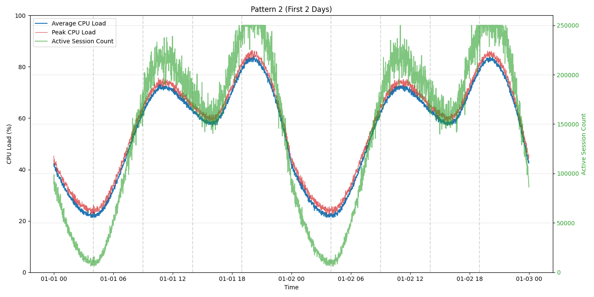

### Pattern 3 — 최저 2시 / 1차 피크 9시 / 최고 19시 (야간 최저)
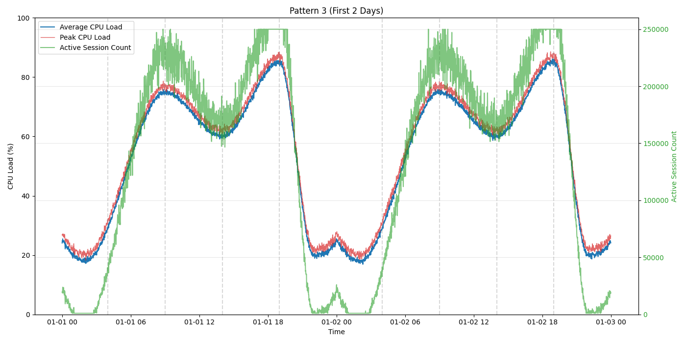

### Pattern 4 — 최저 5시 / 1차 피크 12시 / 최고 19시 (점심 피크)
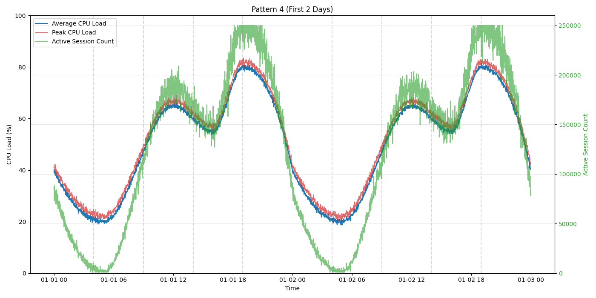

### Pattern 5 — 최저 3시 / 1차 피크 10시 / 최고 18시 (이른 저녁)
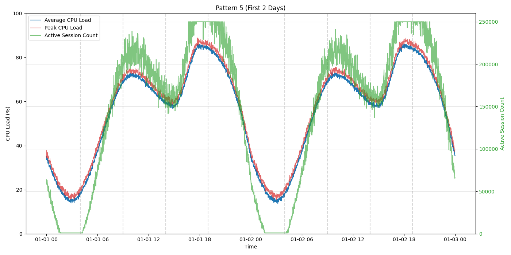

### Pattern 6 — 최저 5시 / 1차 피크 9시 / 최고 21시 (늦은 저녁)
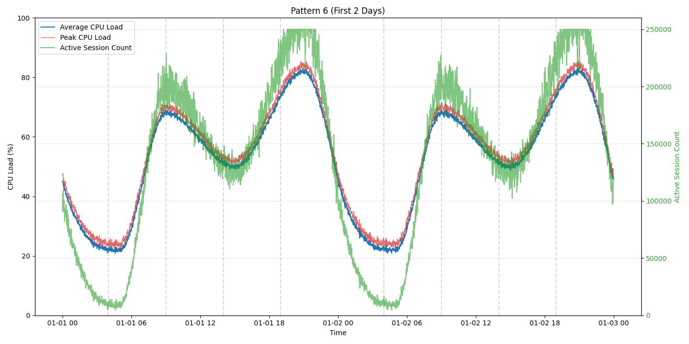

### Pattern 7 — 최저 4시 / 1차 피크 8시 / 최고 17시 (업무시간 집중형)
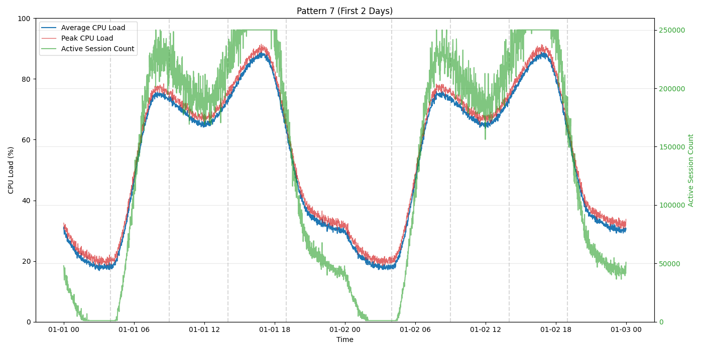

### Pattern 8 — 최저 6시 / 1차 피크 13시 / 최고 20시 (늦은 시작)
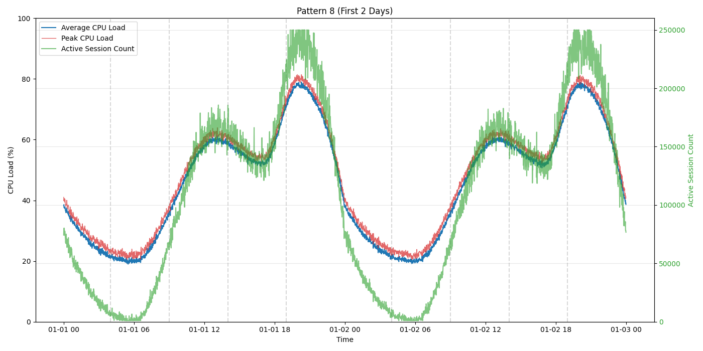

### Pattern 9 — 최저 3시 / 1차 피크 11시 / 최고 18시 (오후 집중형)
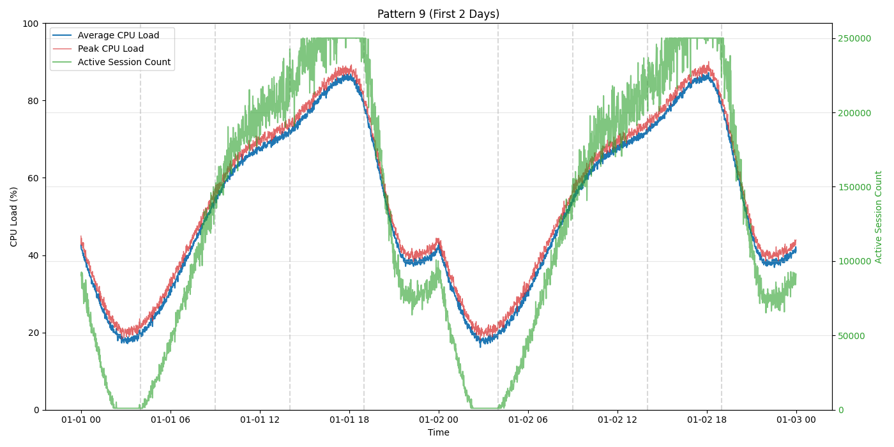

---

## Test Dataset (5 patterns × 5일 = 총 36,000 rows → `ai_test_dataset.csv`)

테스트셋은 **Known 3개 + Unknown 2개**로 구성됩니다.

- Known: 트레인셋에 포함된 패턴과 동일한 형태 → 모델이 올바르게 분류해야 함
- Unknown: 트레인셋에 없는 새로운 패턴 → 모델의 이상 탐지 / OOD(Out-of-Distribution) 대응 능력 평가용

### Known — Pattern 0
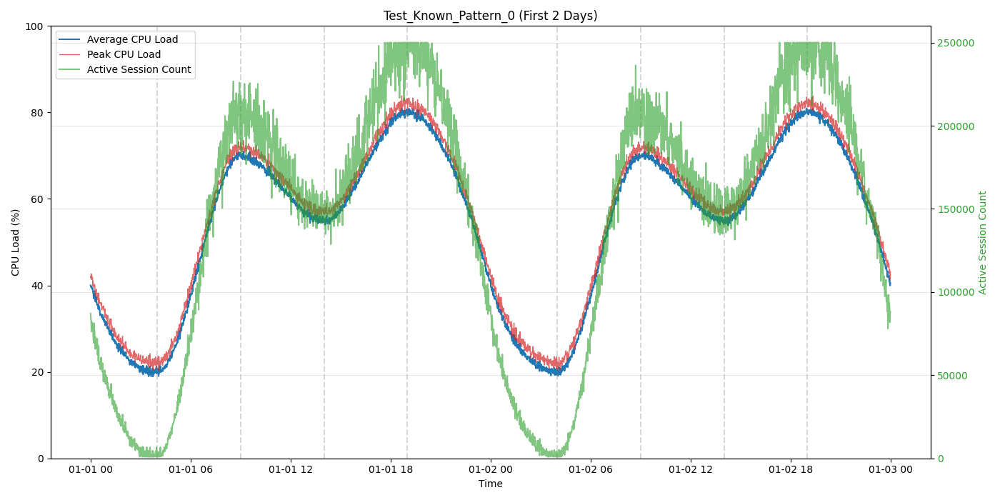

### Known — Pattern 3
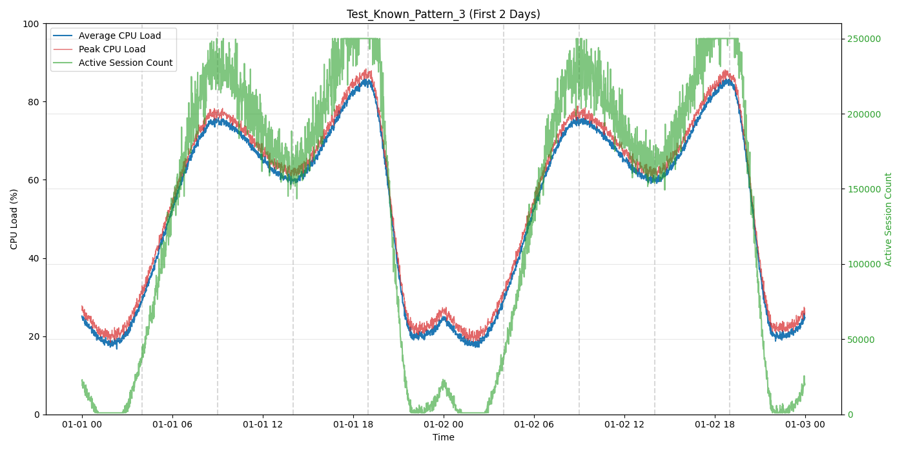

### Known — Pattern 7
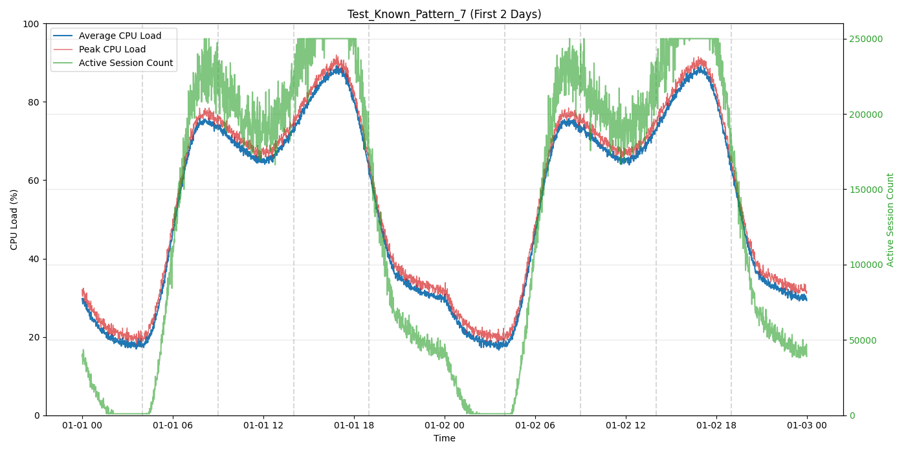

### Unknown — U0 (최저 1시 / 1차 피크 7시 / 최고 15시, 야간 업무 시스템형)
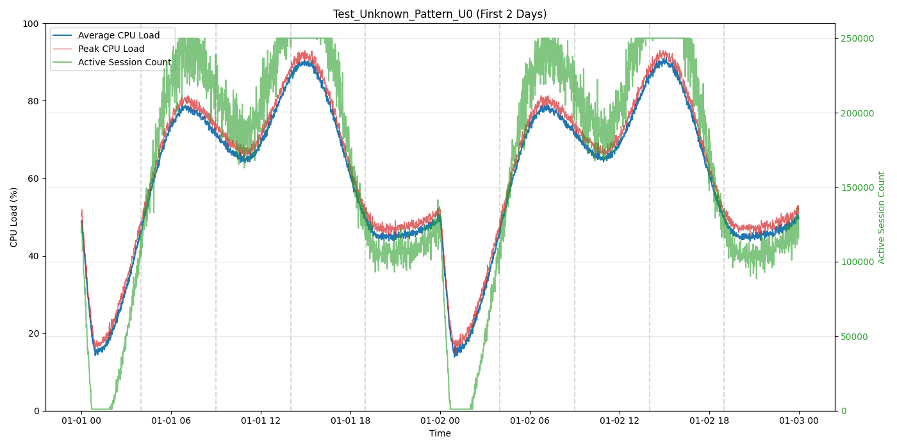

### Unknown — U1 (최저 8시 / 1차 피크 14시 / 최고 23시, 심야 배치 작업형)
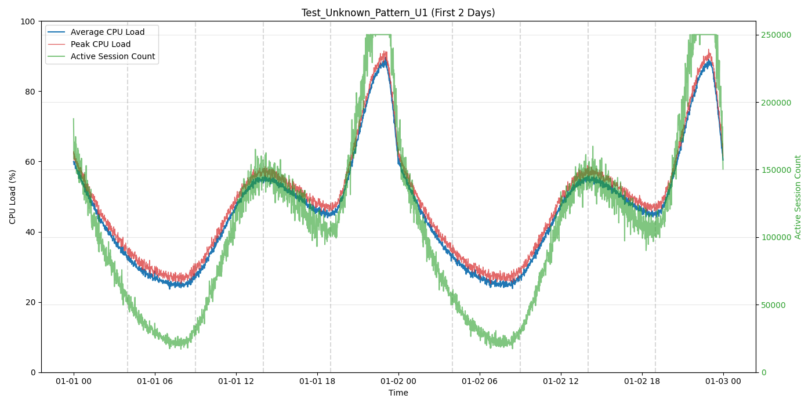

---

## 파일 목록

```
# Train (10 patterns × 30일 = 300일치)
ai_training_dataset.csv

# Test (5 patterns × 5일 = 25일치)
ai_test_dataset.csv
```

각 CSV에는 `pattern_id` 컬럼이 포함되어 있어 패턴 구분이 가능합니다.

| 파일 | pattern_id 값 |
|------|--------------|
| ai_training_dataset.csv | 0 ~ 9 |
| ai_test_dataset.csv (known) | known_0, known_3, known_7 |
| ai_test_dataset.csv (unknown) | unknown_0, unknown_1 |

## 재현

```bash
pip install pandas numpy matplotlib scipy
python datagen.py
```
